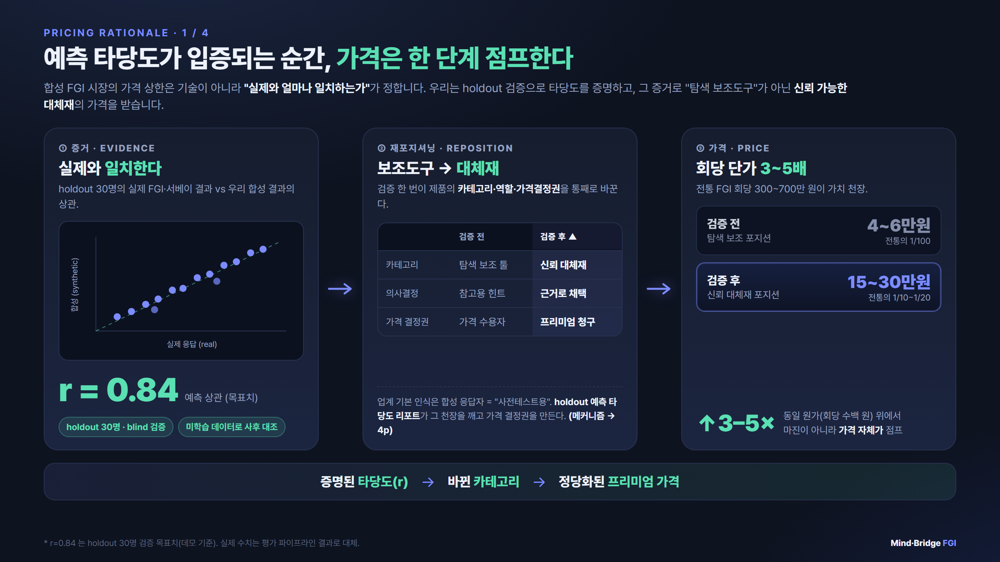
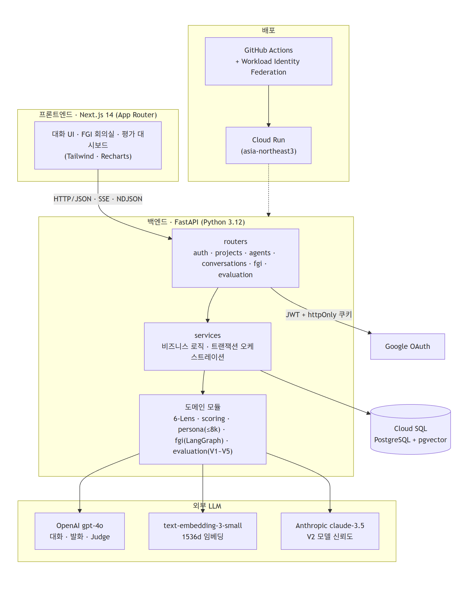
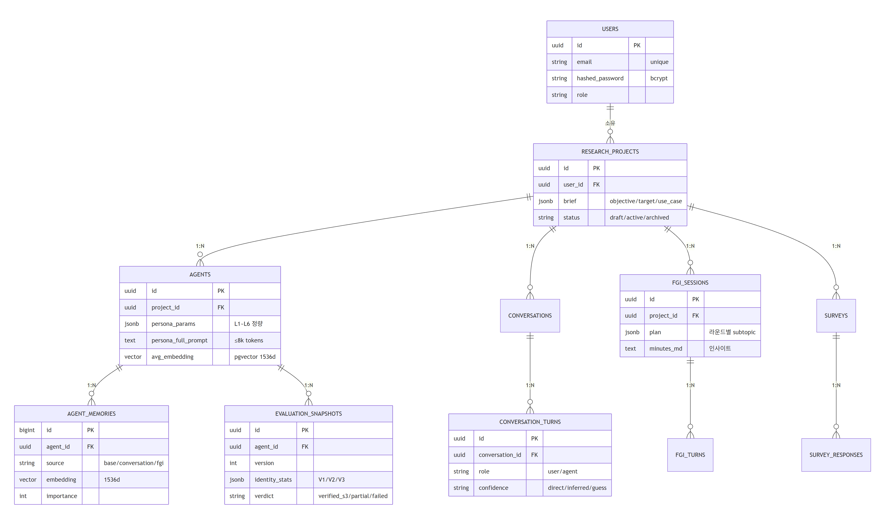

# Mind-Bridge

> 소비자를 에이전트로 보존하고, 대화·FGI로 키워가며 인사이트를 얻는 **소비자 리서치 플랫폼**

---

## 1. 프로젝트 개요

기존 설문·인터뷰는 1회성으로 데이터를 수집하고 폐기해, 같은 소비자에게 다시 묻거나 응답을 누적해 깊이를 더할 수 없다. Mind-Bridge는 학술 검증된 한국어 패널 데이터(Twin-2K-500)를 **소비자 에이전트**로 보존하고, 1:1 대화와 다자 FGI를 통해 지속적으로 성장시키며 심층 인사이트를 발굴한다. 단발성 정성조사를 반복 가능한 자산으로 바꾸는 것이 목표이며, 에이전트의 신뢰도를 V1~V5 지표로 정량 검증해 "그럴듯한 환각"이 아니라 실제 응답과 동기화된 결과임을 보장한다.

## 2. 주요 기능 (기술적 난이도 중심)

> 로그인·CRUD 등 기본 기능은 생략하고, 구현 난이도가 높은 핵심만 정리했다.

### 🎭 Hybrid Persona Prompt — 234문항을 8k 토큰으로 압축
234개 설문 응답을 그대로 풀어쓴 풀-프롬프트(약 42k 토큰)는 *lost-in-the-middle* 로 개별성이 흐려지고 비용도 크다. 6-Lens(경제·의사결정·동기·사회·가치·시간) 정량 지표를 자연어로 풀고 정성 원문만 선별 합성해 **≤ 8k 토큰**으로 압축, 입력 비용을 턴당 $0.105 → $0.02로 약 80% 절감하면서 개별성을 보존한다.

### 🗣️ LangGraph FGI 다자 회의 엔진 — 사용자 실시간 개입
모더레이터 → 다중 에이전트 발언 → 라운드 요약 → 반복을 LangGraph 상태머신으로 구성하고, **yield/resume 패턴**으로 진행 중간에 사용자가 직접 토론에 끼어들 수 있다. SSE로 `user_turn_required` 이벤트를 흘려 비동기 회의 진행 중 실시간 발언 삽입을 지원한다.

### 📊 V1~V5 에이전트 신뢰도 평가 엔진
원본 응답과의 코사인 유사도(V1), GPT-4o vs Claude 동일 페르소나 교차검증(V2), 30명 에이전트 간 거리로 mode-collapse 검출(V3), Judge LLM 자연스러움 채점(V4), 반사실 자극에 대한 일관성(V5)을 임베딩 + 다중 LLM 호출로 산정해 `verified_s3 / partial / failed` verdict를 자동 부여한다.

## 3. 시스템 아키텍처

Next.js 프론트가 SSE/NDJSON으로 FastAPI 백엔드와 통신하고, 백엔드는 `routers → services → 도메인 모듈(6-Lens·persona·fgi·evaluation)` 계층으로 분리된다. LLM(OpenAI·Anthropic)·임베딩·DB는 도메인 계층에서만 호출하며, 배포는 GitHub Actions(WIF) → Cloud Run으로 자동화한다.

## 4. ERD

프로젝트 → 에이전트 → (메모리 / 평가 스냅샷)이 핵심 축이다. 에이전트의 페르소나·메모리는 pgvector 임베딩으로 저장돼 retrieval에 쓰이고, 평가 결과는 `evaluation_snapshots`에 **회차별 시계열**로 누적해 에이전트 성장을 추적한다.

## 5. 기술적 의사결정

| 결정 | 선택 | 왜 |
|---|---|---|
| 인증 | **JWT + httpOnly 쿠키** | 액세스 토큰은 stateless로 다중 서버 검증이 빠르고, 리프레시는 httpOnly 쿠키 + SHA-256 해시 저장으로 XSS·토큰 탈취에 대응 |
| 소셜 로그인 | **Google OAuth 2.0** | 리서처·기업 사용자의 진입 장벽을 낮추고 별도 비밀번호 관리 부담 제거 |
| LLM 구성 | **OpenAI gpt-4o + Anthropic claude-3.5** | 대화·Judge는 gpt-4o, V2 모델 신뢰도 평가는 서로 다른 벤더로 교차검증해 단일 모델 편향 제거 |
| DB | **PostgreSQL + pgvector** | 다단계 1:N 관계와 임베딩 벡터 검색을 한 DB에서 처리, Alembic으로 스키마 추적 (로컬은 SQLite 호환) |
| CI/CD | **GitHub Actions + Workload Identity Federation** | 장기 서비스 계정 키 없이 OIDC로 GCP 리소스에 접근해 시크릿 유출 위험 제거 |

---

### 기술 스택

| 영역 | 기술 |
|---|---|
| Frontend | Next.js 14 (App Router) · TypeScript 5 · Tailwind · Recharts |
| Backend | FastAPI (Python 3.12) · SQLAlchemy 2.0 async · Alembic · LangGraph + LangChain |
| LLM | OpenAI `gpt-4o` · `text-embedding-3-small` · Anthropic `claude-3.5-sonnet` (V2) |
| DB | Cloud SQL PostgreSQL + pgvector (운영) · SQLite (로컬) |
| 인증 / 배포 | JWT + Google OAuth · GCP Cloud Run · GitHub Actions(WIF) |

### 문서 (SSOT)

[`docs/PRD.md`](docs/PRD.md) · [`docs/ARCHITECTURE.md`](docs/ARCHITECTURE.md) · [`docs/DATA_MODEL.md`](docs/DATA_MODEL.md) · [`docs/EVAL_SPEC.md`](docs/EVAL_SPEC.md) · [`docs/6-LENS_MAPPING.md`](docs/6-LENS_MAPPING.md) · [`docs/adr/`](docs/adr/)

> 데이터셋: Toubia, O. et al. (2025). *Database Report: Twin-2K-500.* Marketing Science, 44(6). · 패널 응답 원본·임베딩 캐시·DB 덤프는 git 커밋 금지.
