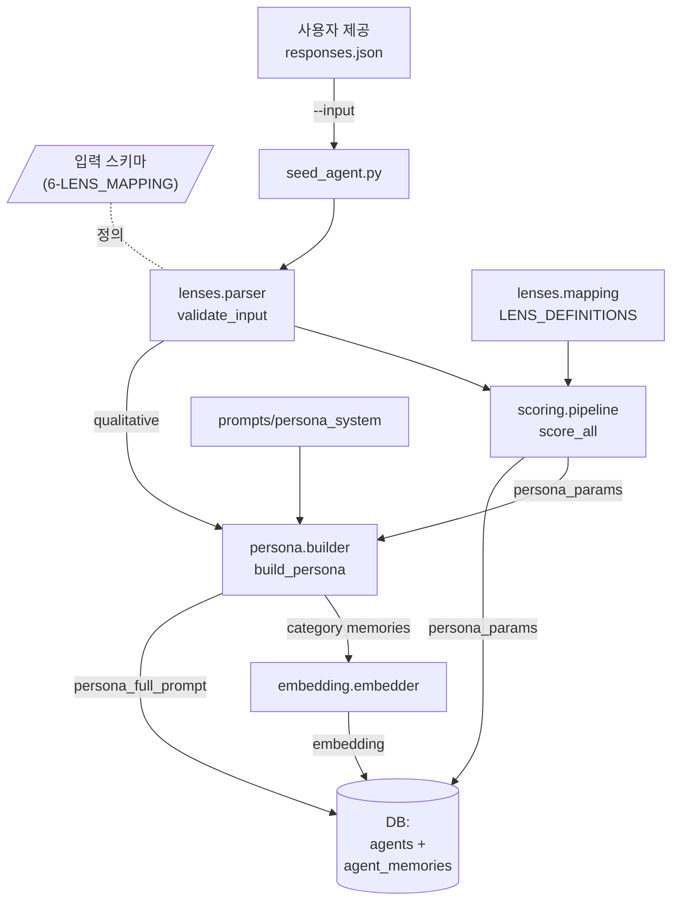

# Plan 0002 — Ditto MVP-1: 6-Lens 인프라 + Persona Builder + 적재 구조

- **상태:** Active (작성일 2026-05-07)
- **선행 plan:** [docs/plans/active/0001-archive-and-bootstrap-ditto.md](docs/plans/active/0001-archive-and-bootstrap-ditto.md) (Phase 0+1 완료 — 커밋 `818b254`)
- **종류:** feat (대규모 — 신규 backend 모듈 + DB 스키마 + 매핑 문서)
- **브랜치:** `feat/ditto-mvp-1-six-lens`
- **PR 분할:** 가능하면 1 PR. 너무 길어지면 (a) 매핑 + 스키마, (b) 코드 모듈 + 적재 스크립트로 2분할 가능
- **예상 일정:** 1.5~2주 (1인 풀타임)

## 1. 목적 & 비범위

### 1.1 목적
1. Twin-2K-500 한국어 v1.1 PDF 의 28 척도 ≈ 234 문항을 L1~L6 + 정성/Ability/Demographics 9 그룹으로 매핑하는 단일 진실 공급원 ([docs/6-LENS_MAPPING.md](docs/6-LENS_MAPPING.md)) 완성.
2. "사용자가 응답 데이터(JSON/CSV)를 주입 → 자동으로 `agents` + `agent_memories` 적재 → Hybrid Persona Prompt 합성"의 무인 파이프라인 구축.
3. Phase 3 (1:1 대화 + V1 평가) 진입에 필요한 backend 셸·DB·인증을 archive 로부터 선별 이식.

### 1.2 비범위 (이번 plan)
- 실제 30명 적재 — 사용자가 응답 데이터를 제공한 시점에 별도 액션(Phase 2.5).
- HuggingFace 영어 응답 다운로드 / 자동 번역 (사용자가 한국어 데이터를 직접 제공).
- 1:1 대화·FGI 엔진, 평가 V1~V5, 대시보드 UI (Phase 3+).
- Frontend 본격 작업 — 셸(layout, auth 페이지) 만 archive 에서 이식, 새 화면은 Phase 3.

## 2. 핵심 의사결정 (사용자 확정)

| ID | 결정 |
|---|---|
| **D1 — 데이터 소스** | 사용자가 한국어 응답 JSON/CSV 제공. 인프라는 그 형식을 받을 수 있는 구조로 설계. HuggingFace 의존성 X. |
| **D2 — Twin v2 적재 인원** | (이번 plan 에선 미적재) 사용자 데이터 도착 시 30명. 인프라는 N 명 가변. |
| **D3 — 한국어/영어** | 입력 = 한국어. LLM 번역 호출 없음. |
| **D4 — DB 격리** | 신규 `agents`/`agent_memories` 만 사용. archive `panels`/`panel_memories` 는 손대지 않음. |

## 3. 사용자 응답 입력 스키마 (Plan 의 핵심 산출 중 하나)

`backend/scripts/seed_agent.py --input <responses.json>` 가 받을 JSON 스키마. M1 작성 시 [docs/6-LENS_MAPPING.md](docs/6-LENS_MAPPING.md) 의 모든 문항 ID 와 1:1 매칭되도록 정의. 잠정 형태:

```json
{
  "respondent_id": "kr_001",
  "collected_at": "2026-05-15T...",
  "demographics": {
    "age_range": "30-39",
    "gender": "female",
    "region": "서울",
    "occupation": "사무직",
    "education": "대졸",
    "marital_status": "기혼",
    "income": "...",
    "household_size": "..."
  },
  "responses": {
    "L1-1.Q1.row_first_certain": 5,           // CE 산출용 — 처음 우측 선호한 행
    "L1-2.Q4.row_first_certain": 7,
    "L1-3.Q1": "A",
    "L1-4.Q1": 6,
    "L1-4.Q2a": 3,
    "L1-4.Q2b": 4,
    "L2-2.Q1": 5,                              // Need for Cognition 7점 척도
    "L6-1.Q1.x_first_chose_later": 4500,
    "C-1.Q1": "10센트",                         // CRT 정답/오답
    "C-2.Q1": "True",                           // 금융 이해 OX
    "C-3.Q1": 200,                              // 수리 자유응답
    ...
  },
  "qualitative": {
    "self_actual": "<한국어 자유응답>",
    "self_aspire": "<...>",
    "self_ought": "<...>",
    "dictator_reasoning": "<...>",
    "ultimatum_reasoning": "<...>",
    "trust_reasoning": "<...>"
  }
}
```

`responses` 키 명명 규칙 = `<척도ID>.<문항번호>(.<세부키>)` (M1 에서 6-LENS_MAPPING 표 작성과 동시에 확정).

## 4. 마일스톤 분할

### M1 — PDF 분석 + [docs/6-LENS_MAPPING.md](docs/6-LENS_MAPPING.md) 완성 (1.5~2일)

**산출물:** 매핑 표 + 입력 스키마 + 채점 공식 명세

작업:
1. `Twin2K500_KR_Localized_v1_1.pdf` 28 섹션 전체 읽기.
2. 각 척도(예: 1-1 Risk Aversion)에 대해 표에 기재:
   - 척도 ID (`L1-1`), 한글 명칭, 문항 수, 응답 형식.
   - 채점 공식 (CE, λ, 평균, 역채점, 정답수 합산 등).
   - 산출 `persona_params` JSONB 키 (`l1.risk_aversion`, `l1.loss_aversion_lambda` ...).
   - 입력 스키마의 `responses` key 명명 규칙.
3. 각 정성 항목(self_actual/aspire/ought, dictator_reasoning 등)을 `qualitative.*` 로 기재.
4. 모호한 분류(예: 미니멀리즘 → L3 vs L5)는 [매핑 의사결정 로그] 섹션에 사유 기록.
5. CRT/금융이해/수리는 정답이 한국화 v1.1 에서 어떻게 보존되는지 PDF "원칙 4" 에 따라 검증.

검증:
- [ ] 28 척도 모두 L1~L6 또는 Q/A/D 중 하나에 배정.
- [ ] 모든 행에 `persona_params` 키 또는 `scratch.*` 저장 위치 명시.
- [ ] 입력 스키마 JSON 예시 1건이 표의 모든 키를 채울 수 있음.

### M2 — Backend 셸 부트스트랩 (1일)

**산출물:** 빈 FastAPI 앱이 `uvicorn main:app --reload` 로 뜬다.

archive 에서 이식할 파일:
- [archive/bdml-fgi/backend/main.py](archive/bdml-fgi/backend/main.py) → `backend/main.py` (lifespan + CORS 골격, 라우터 등록은 비움)
- [archive/bdml-fgi/backend/database.py](archive/bdml-fgi/backend/database.py) → `backend/database.py` (engine/SessionLocal 만, 테이블 정의 비우고 신규 모델만)
- [archive/bdml-fgi/backend/services/openai_client.py](archive/bdml-fgi/backend/services/openai_client.py) → `backend/services/openai_client.py`
- [archive/bdml-fgi/backend/services/auth_service.py](archive/bdml-fgi/backend/services/auth_service.py) → `backend/services/auth_service.py`
- [archive/bdml-fgi/backend/services/usage_tracker.py](archive/bdml-fgi/backend/services/usage_tracker.py) → `backend/services/usage_tracker.py`
- [archive/bdml-fgi/backend/routers/auth.py](archive/bdml-fgi/backend/routers/auth.py) → `backend/routers/auth.py`
- [archive/bdml-fgi/backend/routers/usage.py](archive/bdml-fgi/backend/routers/usage.py) → `backend/routers/usage.py`
- [archive/bdml-fgi/backend/Dockerfile](archive/bdml-fgi/backend/Dockerfile) → `backend/Dockerfile`
- [archive/bdml-fgi/backend/requirements.txt](archive/bdml-fgi/backend/requirements.txt) → `backend/requirements.txt` (+ `anthropic>=0.30.0` 미리)

신규 작성:
- `backend/__init__.py`, `backend/.env.example`, `backend/models/__init__.py`, `backend/models/schemas.py` (빈 Pydantic 베이스)

### M3 — DB 스키마 + Alembic (1일)

**산출물:** `alembic upgrade head` 가 신규 테이블 생성 + archive `projects` 가 rename 됨.

작업:
1. `backend/alembic/` 초기화 (`alembic init`).
2. 마이그레이션 0001 — initial:
   - `users` (archive 동일).
   - `refresh_tokens` (archive 동일).
   - `activity_logs` (archive 동일).
   - `research_projects` (신규).
   - `agents` (신규 — `source_type='twin'|'survey'`, `persona_params` JSONB, `persona_full_prompt` TEXT, `avg_embedding` vector(1536)).
   - `agent_memories` (신규 — `source='base'|'conversation'|'fgi'`, `category`, `text`, `importance`, `embedding`).
   - `evaluation_snapshots` (신규 — `identity_stats`, `logic_stats`, `verdict`).
   - **archive 호환:** archive 의 `projects` / `project_edits` 가 같은 DB 에 있을 수 있으므로 `IF NOT EXISTS` 경로로 신설하고, 충돌 시 `projects_v1_bdml` 로 rename 하는 0002 마이그레이션을 별도로 두되 SQLite 호환 테스트.
3. SQLite (aiosqlite) + PostgreSQL 양쪽 호환 검증:
   - JSONB → SQLite JSON 폴백.
   - vector(1536) → SQLite TEXT(JSON) 폴백 (archive 의 `panels.embedding` 처리 방식 참조).
4. [docs/DATA_MODEL.md](docs/DATA_MODEL.md) 와 1:1 일치 검증.

### M4 — `lenses/` + `scoring/` 모듈 (2~3일)

**구조:**

```
backend/lenses/
├── __init__.py
├── mapping.py        # M1 표를 코드화 — Lens 정의 dict + 척도→Lens 매핑
├── parser.py         # 입력 응답 dict → 척도별 정리된 raw_responses
└── exceptions.py     # MappingError, ResponseFormatError

backend/scoring/
├── __init__.py
├── reverse_score.py  # _reverse(value, max_v) 일반화
├── economic.py       # CE(certainty equivalent), λ(loss aversion), 할인율 연환산
├── ability.py        # 정답 수 합산
├── likert.py         # Likert 평균/역채점
└── pipeline.py       # raw_responses + Lens 정의 → persona_params JSONB
```

핵심 함수:
- `lenses.mapping.LENS_DEFINITIONS: dict[str, ScaleDefinition]` — 28 척도 정의 (Pydantic).
- `scoring.pipeline.score_all(raw_responses, lens_defs) -> dict` — `{l1: {...}, l2: {...}, ..., ability: {...}}` 형태로 반환.
- `lenses.parser.validate_input(input_json)` — M1 의 입력 스키마 검증.

테스트:
- `backend/tests/lenses/test_mapping.py` — 28 척도 모두 정의됨 + 9 그룹 분류 정합성.
- `backend/tests/scoring/test_economic.py` — Risk Aversion CE 계산 (PDF Q1: 좌측 EV=3000, 우측 처음 선호 x=2500 → CE=2500, score=(3000-2500)/3000≈0.167).
- `backend/tests/scoring/test_likert.py` — 역채점 (5점 척도 응답 4 → 역채점 후 2).
- `backend/tests/scoring/test_pipeline.py` — fixture 입력 → persona_params 형식 검증.

### M5 — `persona/` + Hybrid Prompt Builder (2일)

**구조:**

```
backend/persona/
├── __init__.py
├── builder.py        # build_persona(persona_params, scratch, qualitative) -> str
├── compressor.py     # 토큰 카운터 + 8k 초과 시 정성응답 trim
└── intro.py          # 카드용 한국어 1~2 문장 소개 생성

backend/prompts/
├── __init__.py
└── persona_system.py # [수치 가이드] + [원문 가이드] + [제약 사항] 템플릿
```

`prompts/persona_system.py` 템플릿 (잠정):

```
당신은 다음 사람의 디지털 트윈입니다. 모든 답변은 아래 성향과 직접 작성한 사고 방식에 근거합니다.

[수치 기반 가이드 — 6-Lens]
{l1_summary}    # 예: "위험 회피 점수 0.9로 매우 높으며, 새로운 시도보다 안정을 추구합니다."
{l2_summary}
{l3_summary}
{l4_summary}
{l5_summary}
{l6_summary}
{ability_summary}

[원문 기반 가이드 — 자기 정체성]
당신은 스스로를 다음과 같이 정의합니다:
"{self_actual}"
당신이 이상적으로 되고 싶은 모습:
"{self_aspire}"
당신이 의무라고 느끼는 모습:
"{self_ought}"

[제약 사항]
1. 모든 답변은 위 성향과 사고 방식에 근거합니다.
2. 데이터에 없는 상세는 추측하지 말고 "잘 모르겠다"고 답합니다.
3. 답변은 자연스러운 한국어 1인칭 톤.
4. 답변 끝에 [[CITE: <카테고리,...> | CONF: direct|inferred|guess|unknown]] 마커.
```

각 `_summary` 는 정적 템플릿 + 임계값 기반 텍스트 (예: `risk_aversion >= 0.7 → "매우 높음"`).

테스트:
- `backend/tests/persona/test_builder.py` — fixture persona_params → 시스템 프롬프트 생성 + 핵심 키워드 포함 검증.
- `backend/tests/persona/test_compressor.py` — 8k tokens 초과 입력 → trim 후 ≤8k 검증.

### M6 — `embedding/` + `seed_agent.py` (1일)

**구조:**

```
backend/embedding/
├── __init__.py
├── embedder.py       # archive embedder.py 거의 동일
└── cache.py          # embedding_cache.json (gitignore)

backend/scripts/
├── __init__.py
└── seed_agent.py     # CLI: --input <json|csv> --project-id <uuid>
                      #      [--limit N] [--resume] [--dry-run]
```

`seed_agent.py` 의 흐름:

```
입력 JSON 파일
   │
   ▼
lenses.parser.validate_input        # 스키마 검증
   │
   ▼
scoring.pipeline.score_all          # persona_params JSONB
   │
   ▼
persona.builder.build_persona       # persona_full_prompt
   │
   ▼
embedding.embedder.embed (각 카테고리 메모리)
   │
   ▼
INSERT INTO agents + agent_memories (source='base')
   │
   ▼ (모든 적재 후)
sklearn KMeans(K=5) on agents.avg_embedding → cluster 라벨
```

옵션:
- `--dry-run`: DB 쓰지 않고 산출물(persona_params, persona_full_prompt) 표준출력만.
- `--limit N`: 입력 데이터 앞부분 N 건만.
- `--resume`: `agents.source_ref` 가 이미 존재하면 건너뜀.
- `--refresh-prompt`: 기존 적재본의 `persona_full_prompt` 만 재합성.

### M7 — Mock fixture + Smoke Test (0.5~1일)

**산출물:** mock 응답 1~3건으로 전체 파이프라인 검증.

작업:
1. `backend/tests/_fixtures/sample_response_kr_001.json` — M1 의 입력 스키마를 따른 1명분 mock 데이터 (사용자가 줄 데이터 형태와 동일하게 제작).
2. `backend/tests/test_seed_agent.py`:
   - mock 입력 → seed_agent --dry-run → persona_params/full_prompt 생성 성공.
   - mock 입력 → seed_agent (DB SQLite) → `agents` 1 row + `agent_memories` ≥9 rows (Lens 별 1 카테고리 이상).
   - persona_full_prompt 토큰 수 < 8k.
3. (옵션) 3명 fixture 로 KMeans cluster 라벨 부여 확인.

검증:
- [ ] `pytest backend/tests/` 전부 통과.
- [ ] `python -m scripts.seed_agent --input tests/_fixtures/sample_response_kr_001.json --dry-run` 정상.
- [ ] 출력된 persona_full_prompt 가 한국어로 자연스럽고, 6 Lens 모두에서 적어도 1줄 이상 차지.

## 5. 신규 디렉터리 트리 (Phase 2 종료 시)

```
backend/
├── main.py
├── database.py
├── alembic.ini
├── alembic/
│   ├── env.py
│   └── versions/
│       └── 0001_initial.py
├── models/
│   └── schemas.py
├── routers/
│   ├── __init__.py
│   ├── auth.py              # archive 이식
│   └── usage.py             # archive 이식
├── services/
│   ├── auth_service.py      # archive 이식
│   ├── usage_tracker.py     # archive 이식
│   └── openai_client.py     # archive 이식
├── lenses/                  # 신규
│   ├── mapping.py
│   ├── parser.py
│   └── exceptions.py
├── scoring/                 # 신규
│   ├── reverse_score.py
│   ├── economic.py
│   ├── ability.py
│   ├── likert.py
│   └── pipeline.py
├── persona/                 # 신규
│   ├── builder.py
│   ├── compressor.py
│   └── intro.py
├── prompts/                 # 신규
│   ├── persona_system.py
│   └── (Phase 3+에서 conversation/fgi/judge 추가)
├── embedding/               # 신규
│   ├── embedder.py
│   └── cache.py
├── scripts/
│   └── seed_agent.py        # 신규
├── tests/
│   ├── _fixtures/
│   │   └── sample_response_kr_001.json
│   ├── lenses/
│   ├── scoring/
│   ├── persona/
│   └── test_seed_agent.py
├── requirements.txt
├── Dockerfile
└── .env.example

docs/
├── 6-LENS_MAPPING.md        # M1 에서 완성
├── plans/
│   ├── active/
│   │   └── 0002-ditto-mvp-1-six-lens.md  ← (이 plan)
│   └── completed/
│       └── 0001-archive-and-bootstrap-ditto.md  ← Phase 0+1 완료 시 이동
```

## 6. 데이터 흐름



## 7. 리스크 & 미결정 사항

| ID | 리스크 / 미결정 | 완화 |
|---|---|---|
| R1 | PDF 28 척도 중 한국화 v1.1 에서 측정 구조가 미세하게 바뀐 항목이 있을 수 있음 | M1 작성 시 PDF "원칙 5 측정 구조 보존" 단서를 검증. 차이 발견 시 매핑 의사결정 로그 |
| R2 | 응답 입력 스키마가 사용자 모집 도구(Google Forms 등)의 출력 형식과 안 맞을 수 있음 | M1 종료 시 사용자에게 입력 스키마 예시 보내서 1차 확인. CSV → JSON 변환 헬퍼 추가 가능 |
| R3 | Hybrid Prompt 가 8k tokens 를 초과 (정성응답이 매우 긴 응답자) | `persona/compressor.py` 가 self_actual 등을 우선순위 기반 trim. 임계 도달 시 LLM 압축으로 대체 옵션 (Phase 3 결정) |
| R4 | archive `panels` 테이블과 같은 DB 에서 신규 테이블 도입 시 충돌 | M3 마이그레이션은 신규 테이블 명을 `agents`/`agent_memories` 등으로 분리 (이름 충돌 없음). archive `projects` 만 rename 필요 |
| R5 | SQLite 의 vector(1536) 폴백 — pgvector 가 없는 환경에서 임베딩 비교 성능 저하 | 로컬 dev 는 SQLite + JSON 폴백, 운영은 PostgreSQL + pgvector. seed_agent 는 양쪽 모두 동작 |
| **OQ1** | mock fixture 1~3 명을 어떤 페르소나 스타일로 만들지 (실제 응답자 분포와 무관한 가짜) | M7 입구에서 결정. 잠정: 30대 사무직 여성, 60대 자영업 남성, 20대 학생 남성 — 6-Lens 가 다양하게 분포 |
| **OQ2** | seed_agent 가 받는 한 번에 여러 명 vs 단일 명 입력 | 잠정: 둘 다 지원 — JSON array 또는 single object 자동 감지 |

## 8. 검증 기준 (Phase 2 종료)

- [ ] [docs/6-LENS_MAPPING.md](docs/6-LENS_MAPPING.md) 의 모든 28 척도 행이 채워짐 + 입력 스키마 예시 검증.
- [ ] `alembic upgrade head` 가 SQLite + PostgreSQL 양쪽에서 통과.
- [ ] `pytest backend/tests/` 전 케이스 통과.
- [ ] `python -m scripts.seed_agent --input backend/tests/_fixtures/sample_response_kr_001.json --dry-run` 출력에 9 그룹 모두의 수치 가이드가 포함됨.
- [ ] mock 1명 적재 후 SQLite `agents` 1 row + `agent_memories` ≥9 rows.
- [ ] persona_full_prompt 평균 토큰 < 8000 (8k 한계 + 안전 마진).

## 9. PR 체크리스트

- [ ] 브랜치 `feat/ditto-mvp-1-six-lens` 생성
- [ ] M1~M7 마일스톤 순서대로 진행 (M1 끝나면 M2~M3 병렬 가능)
- [ ] 모든 신규 코드에 한국어 docstring
- [ ] [CLAUDE.md](CLAUDE.md) 의 코드 컨벤션 준수
- [ ] `frontend/src/lib/types.ts` 와 `backend/models/schemas.py` 동기화 (이번 plan 에선 schemas 가 비어 있어도 됨 — Phase 3 부터 채움)
- [ ] [docs/PRD.md](docs/PRD.md), [docs/DATA_MODEL.md](docs/DATA_MODEL.md), [docs/api-spec.md](docs/api-spec.md) 가 실제 코드와 일치하는지 재확인 (어긋나면 문서 먼저 갱신)
- [ ] PR 본문에 검증 기준 §8 의 체크박스 결과 첨부
- [ ] Squash merge 후 plan 을 [docs/plans/completed/](docs/plans/completed/) 로 이동 + 새 plan `0003-ditto-mvp-2-conversation-eval-v1.md` 생성

## 10. 다음 plan 예고 (Phase 3)

Phase 2 merge 후 작성할 [docs/plans/active/0003-ditto-mvp-2-conversation-eval-v1.md](docs/plans/active/0003-ditto-mvp-2-conversation-eval-v1.md):

- 1:1 대화 SSE 모듈 (`backend/conversation/`, `frontend/src/app/projects/[id]/chat/[agentId]`)
- V1 응답 동기화율 평가 엔진 (`backend/evaluation/v1_response_sync.py`)
- 게이지 차트 대시보드 (Recharts)
- archive `lab_service.py` + `lab_citation_service.py` 진화형
- 사용자 응답 데이터 도착 시 Phase 2.5 로 30명 적재 (간단)
